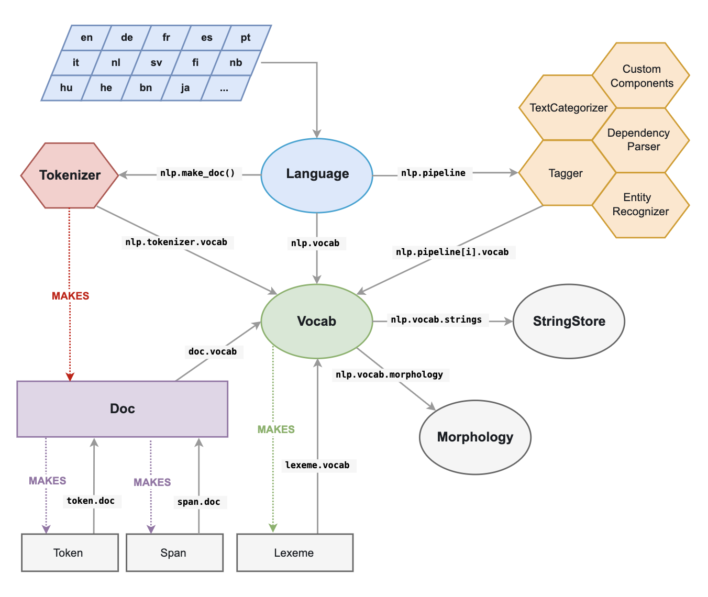
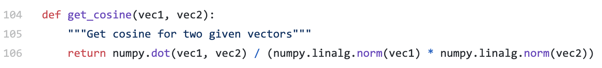
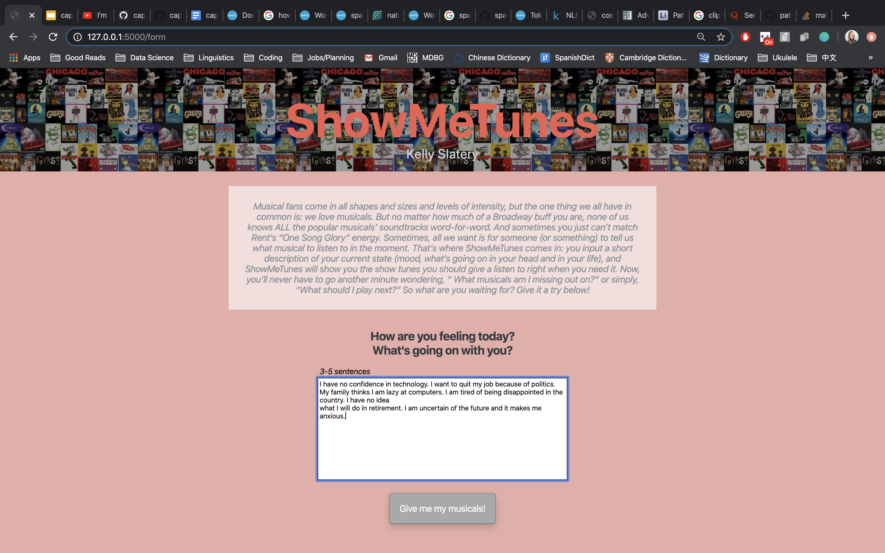
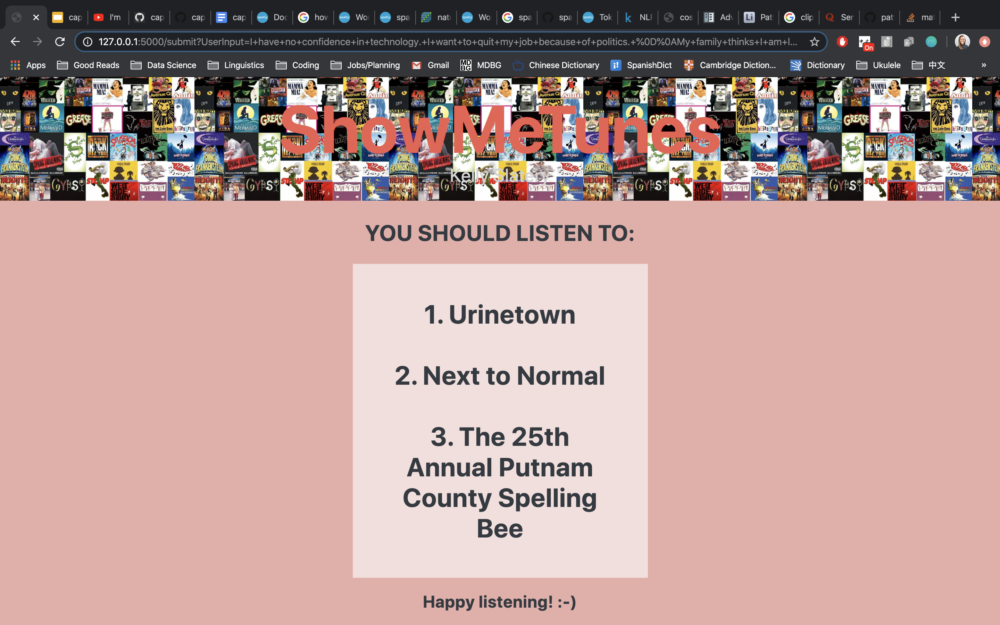

# Capstone: Musical Recommender

Kelly Slatery | US-DSI-10 | 03.13.2020

## Problem Statement

Musical fans come in all shapes and sizes and levels of intensity, but the one thing we all have in common is: we love musicals. But no matter how much of a Broadway buff you are, none of us knows ALL the popular musicals’ soundtracks word-for-word. And sometimes you just can’t match Rent’s “One Song Glory” energy. Sometimes, all we want is for someone (or something) to tell us what musical to listen to in the moment. That’s where ShowMeTunes comes in: you input a short description of your current state (mood, what’s going on in your head and in your life), and ShowMeTunes will show you the show tunes you should give a listen to right when you need it. Now, you’ll never have to go another minute wondering, “ What musicals am I missing out on?” or simply, “What should I play next?”


## Project Directory
```
project-2
|__ code
|   |__ 01_Musicals_Collection.ipynb
|   |__ 02_Synopsis_Collection.ipynb
|   |__ 03_Summary_Collection.ipynb
|   |__ 04_Data_Concatenation.ipynb
|   |__ 05_EDA_and_Cleaning.ipynb
|   |__ 06_Sentiment_Analysis.ipynb
|   |__ 07_Recommender_System.ipynb
|__ assets
|   |__ spacy_architecture.png
|   |__ spacy_cosine_similarity.png
|   |__ musicals.jpg
|   |__ prompt_1_input.png
|   |__ prompt_1_output.png
|   |__ prompt_2_input.png
|   |__ prompt_2_output.png
|__ data
|   |__ musical_names.csv
|   |__ musical_synopses.csv
|   |__ musical_summaries.csv
|   |__ musical_data.csv
|   |__ musical_vectors.csv
|   |__ dbscan_labels.csv
|   |__ kmeans_labels.csv
|   |__ musical_data_vectors_labels.csv
|   |__ musical_sentiments.csv
|   |__ musical_for_app.csv
|__ static
|   |__ css
|   |__ |__ style.css
|__ templates
|   |__ form.html
|   |__ results.html
|__ app.py
|__ showmetunes.py
|__ capstone_presentation.pdf
|__ README.md
```


## Data Collection

The data for the alpha version of this project was pulled from 3 sources:

- [Ranker](ranker.com): musical names for 196 most popular musicals as voted on by the public
- [Wikipedia](wikipedia.com): musical synopses
- [All Musicals](allmusicals.com): musical synopses

First, I scraped [Ranker’s list of best musicals](https://www.ranker.com/crowdranked-list/best-musicals) to get the musical names to make up the corpus of possible recommendations for users. According to [Ranker](https://www.ranker.com/list/how-our-rankings-work/rmach), their rankings are based on a “wisdom of the crowd philosophy”. Anyone can upvote or downvote items on a list, but Ranker also allows people to make an account and become a member, and the Ranker Algorithm rates members’ rerankings of lists more highly. Because I want my recommender to recommend musicals that users will likely enjoy, I wanted to exclude musicals that weren’t very well received by musical fans. Ranker allowed me to use their list for this project, however, if I were to develop it further, I would create my own ranking algorithm based on data from Spotify and Wikipedia, detailed below in [Future Developments](#Future-Developments).

After pulling the list of musical names, I had to gather the data to analyze them. For the alpha version of this project, I chose to use only textual synopses as a basis for comparison with user input. In future versions, as described in [Future Developments](#Future-Developments), I hope to add song lyrics as well. When choosing what sources to use for these synopses, I was surprised to find that there wasn’t nearly as cohesive information about musicals online as there is for movies. This is perhaps given the relative popularity of either form of entertainment, along with the already technical/digital nature of movies versus musicals. In the end, I found [Wikipedia](wikipedia.com) and [All Musicals](allmusicals.com) to provide the best synopses.

Of the 196 musicals scraped from [Ranker](ranker.com), only 2 did not have a synopsis on either [Wikipedia](wikipedia.com) or [All Musicals](allmusicals.com) (“Cyrano” and “Dancin’”). Of the remaining 194, 8 have only an [All Musicals](allmusicals.com) summary and 17 have only a [Wikipedia](wikipedia.com), leaving 169 musicals with two synopses to use for analysis. Synopsis lengths range from 37 words to 2715 words, with a median [Wikipedia](wikipedia.com) summary length of 1132 words and a median [All Musicals](allmusicals.com) summary length around half that, at 509 words.


## Executive Summary
First, I collected the Ranker.com list of the 196 most popular user-ranked musicals using Selenium and BeautifulSoup. Then, using the Requests library and the Wikipedia API, I collected the synopses for each musical from Wikipedia and All Musicals. Using the NLP library, spaCy, and regular expressions, I processed and vectorized the musical synopses. Using TextBlob, I then computed a sentiment rating for each musical synopsis.

Through the Flask application, a user inputs a short description of their mood, answering the questions, “How are you feeling? What’s going on with you?”. Then, using spaCy, the cosine similarity between user input and each musical synopses is computed, and similarities are ranked. Of the top ten, they are ranked by magnitude of difference in sentiment ranking, and then the user is given the top three musicals from that list.

The hope of this project is that users will (a) find music that suits them in-the-moment, as our taste in music often depends on our current mood, (b) be exposed to new musicals, (c) participate in a contemplative exercise by assessing their current state, and (d) have one fewer decision to have to make during the day.


## Data Processing

The data to be processed is all text, so a variety of NLP techniques were used to clean and preprocess the data for a variety of experimental analyses. NLP libraries used or considered for use include:
- [spaCy](https://spacy.io/): most of the processing (extracting important words, word vectorization/embedding)
- [TextBlob](https://textblob.readthedocs.io/en/dev/): sentiment analysis
- [Gensim](https://radimrehurek.com/gensim/index.html): word vectorization
- [Regex](https://docs.python.org/3/library/re.html): removing punctuation
- [nltk](https://www.nltk.org/): removing stopwords, tokenizing
- [Sci-kit learn](https://scikit-learn.org/): CountVectorizer, TfidfVectorizer, clustering models

The large majority of data processing and preprocessing for this project was done with [spaCy](https://spacy.io/). According to the documentation, [spaCy](https://spacy.io/usage/spacy-101) is a “free, open-source library for advanced Natural Language Processing (NLP) in Python.” What this means is, when you import spaCy, you have access to various functionalities built on complex models and cutting edge research that help us process text data to implement our own programs built on text data. Below is a general overview of spaCy’s architecture, taken from the [spaCy documentation](https://spacy.io/api):



Some of the main functionalities offered by spaCy are: Tokenization, Part-of-speech (POS) Tagging, Named Entity Recognition (NER), and [more](https://spacy.io/usage/spacy-101). spaCy also provides pre-trained statistical models for users to use to preprocess their own text data. For the purposes of this project, I used the [spaCy “en_core_web_lg” model](https://spacy.io/models/en#en_core_web_lg) to vectorize musical summaries based on word embeddings.

The name “en_core_web_lg” refers to the fact that this model is the large (lg) English (en) model that includes vectors alongside vocabulary, syntax, and entity tags (core), and is trained on web (web) data from the robust [OntoNotes dataset](https://catalog.ldc.upenn.edu/LDC2013T19). The [Anaconda documentation](https://anaconda.org/conda-forge/spacy-model-en_core_web_lg) describes it as an “English multi-task CNN trained on OntoNotes, with GloVe vectors trained on Common Crawl.” As noted above, [OntoNotes dataset](https://catalog.ldc.upenn.edu/LDC2013T19) is the training data repository for spaCy’s concurrent neural networks that learn word embeddings. [Common Crawl](https://commoncrawl.org/the-data/) is then the training data repository for the [GloVe Algorithm](https://nlp.stanford.edu/projects/glove/), a log-bilinear model (language generation). It contains 8 years of web-scraped data. The [spaCy “en_core_web_lg” model](https://spacy.io/models) is a supervised learning model, and it can be fine-tuned by adding additional, more corpus-specific training data. The process for training a new model is described [here](https://spacy.io/usage/training) in detail, and is part of my plan for [Future Developments](#Future-Developments).


### Data Cleaning Procedure

Data cleaning methods were determined by the vectorizing methods’ input form as well as unique features of the English language and the structure of musical summaries. In future developments, these steps will take place after a model is trained on the text, as punctuation and capital letters are key in identifying word embeddings (relationships). First, using the Python [unicodedata (Unicode Database)](https://docs.python.org/2/library/unicodedata.html) module (a script that you can import into your notebook, included in the python package), I removed all diacritics by replacing them with [ASCII](https://en.wikipedia.org/wiki/ASCII) characters (Aa-Zz and 0-9).

The next step was tokenizing (turning a string/text into a list of words/tokens) and removing stopwords. The [spaCy](https://spacy.io/usage/spacy-101) library provides a pre-defined list of stopwords containing the 326 most common words in the English language. To customize this list a bit, I found the top 25 most common words in the musical summaries and added words from that list which did not appear to provide helpful semantic meaning (‘act’, ‘people’, and ‘reprise’). After removing these stopwords, I also removed all numbers and used spaCy’s [Part-of-speech (POS) tagging function](https://spacy.io/api/annotation#pos-tagging) to remove all words that were not nouns (except pronouns), verbs, adjectives, or adverbs. This also got rid of all punctuation. [POS tags](https://spacy.io/api/annotation#pos-tagging) were derived from the spaCy model [en_core_web_lg](https://spacy.io/models/en#en_core_web_lg), described further below.

The last step in the data cleaning pipeline was lemmatizing the remaining words/tokens. Lemmatization is essentially the process of replacing a word with its “root” word, or the base word that holds semantic meaning without inflections. This is useful because it makes analysis cleaner, recognizing that “ran”, “run”, and “running” all have the same meaning, whereas word embeddings can hopefully catch the difference between “saw” as a verb and a noun, as explained [here](https://nlp.stanford.edu/IR-book/html/htmledition/stemming-and-lemmatization-1.html). Using spaCy, I lemmatized all the words/tokens in by calling the attribute [token.lemma_](https://spacy.io/api/token), which pulled the lemma from a predefined lookup table using hashes. More detail can be found in the [spaCy documentation for the Lemmatizer](https://spacy.io/api/lemmatizer).

The last step in the cleaning process was converting each list of token lemmas (representing a musical summary) into a [spaCy Doc object](https://spacy.io/api/doc), described as a “container for accessing linguistic annotations”. This made vectorization and document similarity between musical synopses and user input easier to calculate later on using the [spaCy “en_core_web_lg” model](https://spacy.io/models/en#en_core_web_lg).

In this project, I imported “en_core_web_lg” as a module (which will have to change if this project is exported for production). Models that come with built-in word vectors make them available as the Token.vector attribute. Doc.vector and Span.vector will default to an average of their token vectors. You can also check if a token has a vector assigned, and get the L2 norm, which can be used to normalize vectors, as attributes.
Each token’s vector has 300 dimensions describign different aspects of that word’s meaning and how it relates to other words. The word vectors is also called a “word embedding”. This model provides around 685,000 unique vectors (according to [this source](https://support.prodi.gy/t/why-the-choice-of-en-vectors-web-lg-to-categorize-insults/808)) for the English language in a look-up table, with different vectors for words when they appear in different contexts.


### Data Exploration and Modeling

Though recommender systems are not able to be validated with an accuracy score like supervised learning models, I came up with two methods to verify that my model meets at least basic standards:

1. Ensure that users are being recommended similar musicals: Cluster musical summaries (based on Doc vectors) using a KMeans unsupervised learning model and cross-check with output (clusters implemented, not deployed)
2. Ensure that all musicals have an equal shot of being recommended: Collect output data from the Flask app, tracking each musical’s frequency of being recommended (not implemented yet)

From the first few example user inputs, it does look like similar musicals are being recommended. As part of the next version of this project, I hope to implement both of these evaluation methods. More ideas are described in the [Future Developments](#Future-Developments) section below.


## Document Similarity

Document similarity describes the method used to compute how similar a user’s input (describing their mood) is to the synopses of different musicals, as represented by their vectors. In [spaCy](https://spacy.io/api/doc), a Doc vector is simply the average of the vectors of all the tokens in the document. All musicals are preprocessed as spaCy Doc objects, and the user’s input is processed first thing when it enters the python script (showmetunes.py).

But how is similarity between vectors computed? In spaCy, it’s a simple as typing doc1.similarity(doc2), and surprisingly, the underlying formula isn’t much more complicated. The function being computed is called “cosine similarity” and it essentially measures the distance between two vectors in a multi-dimensional space, outputting a value between [0,1] with a higher score representing more similarity. What the function computes is the dot product of the two vectors divided by the multiplication of the normalized vectors (using the vector’s L2 norm, which is the the square root of the sum of the vector values squared, as described [here](https://spacy.io/usage/vectors-similarity#basics). For more detail, check out the [spaCy source code](https://github.com/explosion/spaCy/blob/master/spacy/tests/util.py) for cosine similarity below:



Once document similarities were computed between user input and each musical summary, they were made into a pandas DataFrame and sorted by similarity score. Then, the 10 highest-scoring musicals were passed through to get their sentiment analysis scores.


## Sentiment Analysis

Sentiment Analysis at its core is the process of assigning a score [-1,1] to describe how positive or negative a document is. This is usually used for consumer reviews, but I thought it would be useful for this project as well. The primary reason I wanted to incorporate sentiment analysis into this recommender system is that similarity scoring is subjective. Two sentences with similar content and syntax may express opposite sentiments, for example: “I really love math” and “I really hate math”.

For the purposes of this project, I used [TextBlob’s pretrained sentiment analysis model](https://textblob.readthedocs.io/en/dev/advanced_usage.html), based on the default PatternAnalyzer implementation, to get a rough sentiment rating for each document as well as the user input. According to [this source](https://www.quora.com/Sentiment-Analysis-How-does-CLiPS-Pattern-calculate-the-polarity-of-a-sentence-What-is-the-maths-involved-in-it), the model is quite simple: a database of adjectives/adverbs and their individual scores [-1,1] are stored [here](https://github.com/clips/pattern/blob/master/pattern/text/en/en-sentiment.xml). Then, when parsing a text, it will add up the scores of all occurring instances of words in the database, and take the average to represent the document. The average musical summary sentiment rating was 0.088 with a standard deviation of 0.066. Though most scores centered around 0, and this [TextBlob](https://textblob.readthedocs.io/en/dev/index.html) model is obviously not made for working with musical summaries, as a basis for future versions, I still included it in coming up with final recommendations.


## Recommender System

The final musical recommendations output to the user are the top three musicals ranked by magnitude of sentiment score difference from user input sentiment score of the top ten musicals ranked by similarity score.

Using [Flask](https://flask.palletsprojects.com/en/1.1.x/), I have created a locally hosted webpage where users can directly input their short journal entry on how they’re feeling and receive their recommendations within about a minute. Currently, this looks somewhat like the images below:






## Future Developments

There are many parts of this project I would like to continue working on to improve it, make it more my own, and get it ready for deployment.

First, I want to rank musicals myself. I plan to do this by using Wikipedia categories of musicals and then using the Spotify API to access track popularity.

Next, I want to pull more data in the form of “synopses” to use as training data on the spaCy POS tagger and vectorization. I will start with the two sites I used for this iteration’s data ([Wikipedia](wikipedia.com) and [All Musicals](allmusicals.com)) and venture out to some more, like [TheatreMania](https://www.theatermania.com/). Further in the future, I would also like to incorporate lyrics as part of the similarity scoring process, and then perhaps features of the music itself.

Then, I also want to completely revamp the sentiment analysis portion of this project. I hope to, using Topic Extraction methods, create a few different scales for: intensity/chill level, happy/sad, nostalgic/modern (which might come from metadata), or others. I still haven’t pieced together quite how to go about this yet, which is why I ended up using TextBlob in this iteration.

Next, I want to create a user feedback system, where a user can rate the musicals they listened to after receiving the recommendations to let the system know if it was a good recommendation or not. This would be an implementation for further in the future as well.

As for deployment, there are many steps to go about to get ready. On top of incorporating the evaluation techniques described earlier, I would also like to embed a feature that allow the user to input their Spotify login to directly export a playlist of those three musicals’ soundtracks for them to start listening to right away.

## Final Conclusions and Summary

While this is a fun project, it has also been quite a technical learning process. Using my machine, a user can input a short journal entry about their current state--mood, what’s on their mind--and my code will return three musical recommendations to match their mood.
